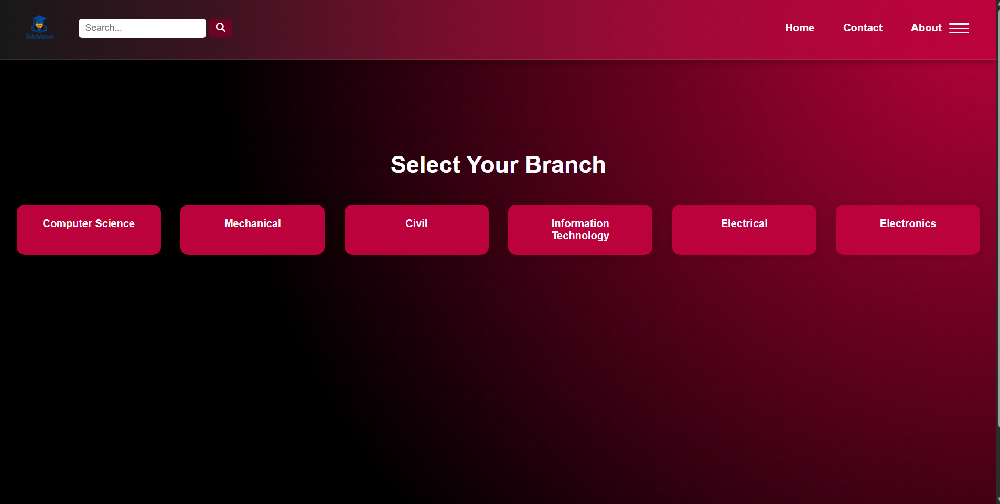
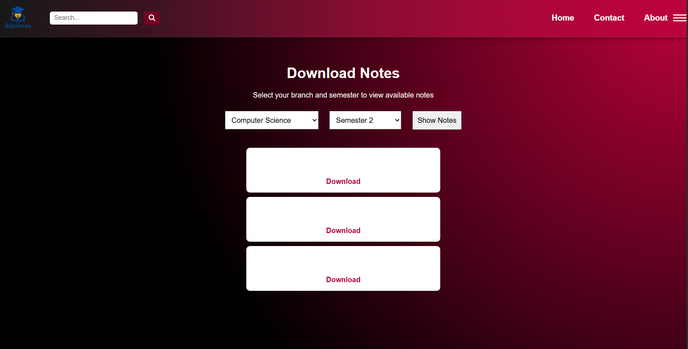
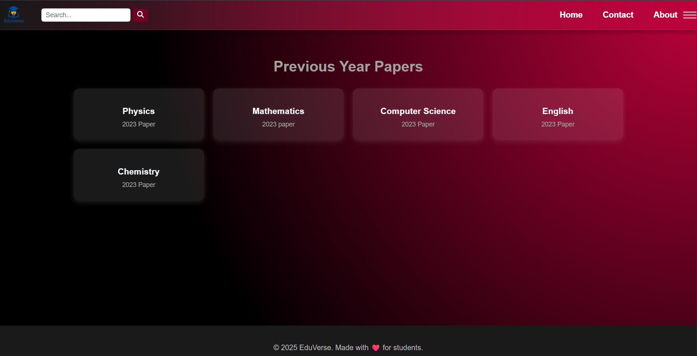
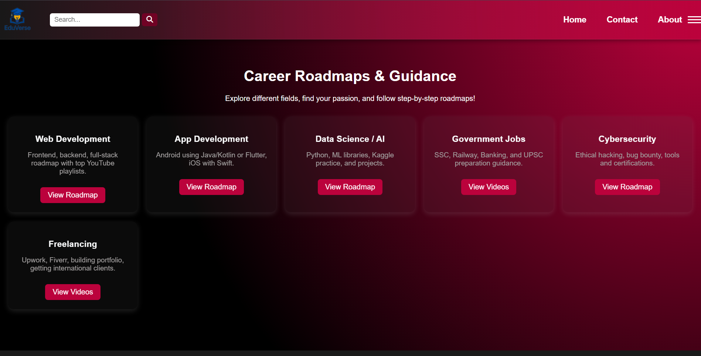
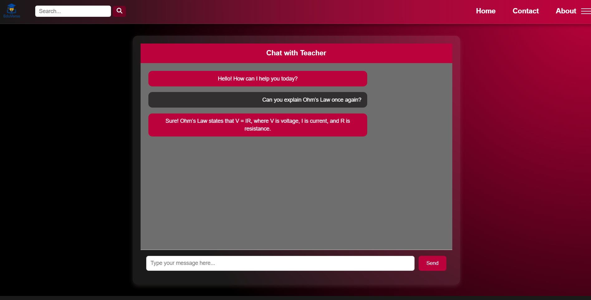
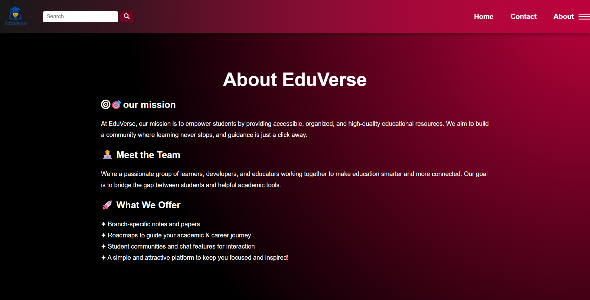
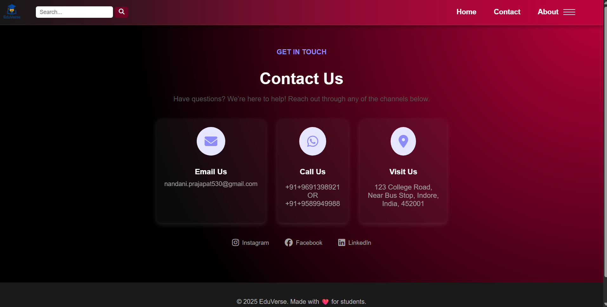

# EduVerse – Student Learning & Career Guidance Platform

EduVerse is a responsive educational website developed using HTML5, CSS3, and JavaScript. It is designed to help students access study materials, previous year question papers, career roadmaps, and academic guidance through a clean and user-friendly interface.

## Project Overview

EduVerse aims to provide students with a single platform where they can easily find academic resources and career-related information. The website focuses on improving the learning experience with a simple, responsive, and organized design.

## Features

- Responsive and user-friendly interface
- Branch-wise study materials
- Semester-wise notes
- Previous year question papers
- Career roadmaps for different technology domains
- Teacher–Student chat interface
- Educational information pages
- Contact and About pages
- Clean navigation and modern UI

- ## Technologies Used

- HTML5
- CSS3
- JavaScript
- Responsive Web Design
- Visual Studio Code
- Git
- GitHub
- Netlify

-## Screenshots

### Home Page

### Branch Selection

### Notes Page

### Previous Year Papers

### Career Roadmaps

### Teacher–Student Chat

### About Page

### Contact Page

## Live Demo

Website: https://eduverse-student-platform.netlify.app/

## Author

**Nandani Prajapat**

- LinkedIn: https://www.linkedin.com/in/nandani-prajapat-3124462a3/?skipRedirect=true

